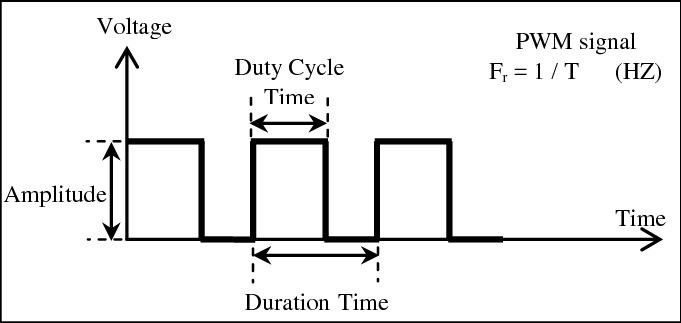

# Začínáme s Raspberry Pi Pico

## Obsah

* [Instalace MicroPython](#instalace-micropython)
* [Programování](#programování)
* [Hello, Pico!](#hello)
* [Rozložení pinů](#rozložení-pinů)
* [RPI_Pico_example_codes](#rpi-pico-example-codes)

## Instalace MicroPython

1.	Stáhněte si [U2F soubor](https://micropython.org/download/rp2-pico/rp2-pico-latest.uf2) s MicroPythonem.
2.	Se stisknutým tlačítkem BOOTSEL připojte Pico k počítači pomocí USB kabelu.
3.	Pico se zobrazí jako vyměnitelné úložište se jménem RPI-RP2.
4.	Přetáhněte U2F soubor do RPI-RP2. Pico se restartuje a spustí se MicroPython interpreter.

## Programování

Rpi Pico se dá naprogramovat v C/C++, MicroPythonu nebo v assembleru. My si ukážeme tu nejjednodušší možnost a to je jednoznačně MicroPython.

Základní workflow: napsat skript, uložit ho s příponou `.py` do úložiště Pica a skript se spustí. Skript se bude spouštět automaticky se zapnutím Pica. Pro nahrání jiného skriptu je zase třeba připojit Pico s držením BOOTSEL tlačítka.

Existují však IDE, které práci zjednodušují tak, že není potřeba pro každou změnu ve skriptu Pico vypínat a zapínat. Doporučeným IDE pro programování RPi Pico v jazyce Python je [Thonny IDE](https://thonny.org/). Dále budeme používat právě Thonny.


Po instalaci spusťte Thonny a v nástrojové liště postupujte tímto způsobem:

1.	Běh -> Vybrat interpreter…
2.	V dialogovém okně vyberte MicroPython (Raspberry Pi Pico) a automatickou detekci portu můžete ponechat.

Pokud vše proběhlo správně, tak by dole v konzoli měl běžet interpreter MicroPython na RPi Pico.

Odteď můžeme s Pico interagovat buď přímo přes konzoli, anebo pomocí skriptů.


## Hello, Pico!

    ```
    >>> print("Hello, Pico!")
    Hello, Pico!
    >>>>
    ```

Dalším krokem bude rozblikání vestavěné LED. Místo konzole už použijeme samotný editor.

    ```python
    # modul machine slouzi k ovladani hardware
    # pro rozblikani LED budeme potrebovat tridu Pin
    from machine import Pin
    from utime import sleep

    # vestavena LED je napojena na pin 25, nejprve je potreba pin inicializovat
    led = Pin(25, Pin.OUT)

    # ted uz staci jen prepinat mezi HIGH a LOW, nejjednoduseji pomoci metody toggle()
    while True:
        led.toggle()
        sleep(1)
    ```

Po přepsání stačí kliknout na zelené tlačítko v horní liště a skript se spustí. Když ho budeme chtít zastavit, stačí kliknout na červené tlačítko zastavit.

## Stmívání LED

Ke stmívání LED se používá PWM = pulzně šířková modulace.


https://www.google.com/url?sa=i&url=https%3A%2F%2Fwww.researchgate.net%2Ffigure%2FPWM-signal-with-its-two-basic-time-periods_fig4_271437313&psig=AOvVaw10SVsBpZIkFZGVLsW6Senh&ust=1626953737873000&source=images&cd=vfe&ved=0CAsQjRxqFwoTCLDa_JiJ9PECFQAAAAAdAAAAABAE

    ```python
    from machine import PWM, Pin
    from utime import sleep_us

    LED_PIN = 25
    BLINK_FREQUENCY = 1
    PWM_FREQUENCY = 200 # nastavime tak aby lidske oko nedokazalo rozpoznat blikani
                        # hranice je okolo 120 Hz muzete vyzkouset :)

    # inicializace trid
    led = Pin(LED_PIN)
    pwm = PWM(led, PWM_FREQUENCY)

    duty = 0
    direction = 1

    while True:
        # overeni jetli je treba obratit smer
        if duty >= 255:
            direction = -1
        elif duty <= 0:
            direction = 1

        # nastaveni nove hodnoty "duty"
        duty += direction
        pwm.duty_u16(duty * duty)

        # nechceme aby se smycka vykonavala nekontrolovane rychle,
        # to by zpusobilo jen ztmaveni
        sleep_us(1_000_000 // BLINK_FREQUENCY // 255 // 2)
    ```

## Čtení z vestavěného teploměru

Teplota se bude vypisovat do konzole.

    ```python
    from machine import ADC
    from time import sleep

    # 3.3 V = referenční napětí, 65535 = největší číslo, které můžeme uložit do 16 bytů
    CONVERSION_FACTOR = 3.3 / 65535

    temp_sensor = ADC(4)

    while True:
        reading = temp_sensor.read_u16() * conversion_factor
        temperature = 27 - (reading - 0.718 ) / 0.001721
        print("Voltage: " + str(reading) + " V, Temperature: " + str(temperature) + " °C")
        sleep(2)
    ```

## Rozložení pinů


## Zdroje a další materiály

[Datasheet](https://datasheets.raspberrypi.org/pico/pico-datasheet.pdf)

[Python SDK](https://datasheets.raspberrypi.org/pico/raspberry-pi-pico-python-sdk.pdf)

[MicroPython](https://micropython.org/)
