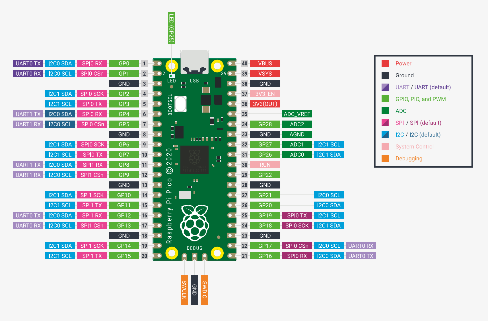

# Začínáme s Raspberry Pi Pico

## Obsah

* [Příprava prostředí](instalace.md)
* [První program](hello.md)
* [PWM](pwm.md)
* [ADC](adc.md)
* [Interrupt](interrupt.md)

## Rozložení pinů

## Zdroje a další materiály

[Datasheet](https://datasheets.raspberrypi.org/pico/pico-datasheet.pdf)

[Python SDK](https://datasheets.raspberrypi.org/pico/raspberry-pi-pico-python-sdk.pdf)

[MicroPython](https://micropython.org/)

    <a href="hello.md">Příprava vývojového prostředí</a>

