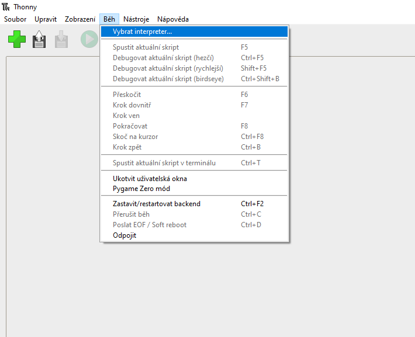
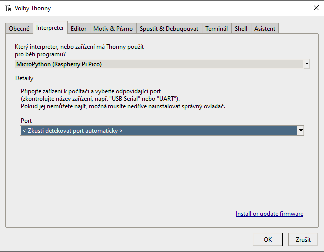

## MicroPython

Rpi Pico se dá naprogramovat v C/C++, MicroPythonu nebo v assembleru. My si ukážeme tu nejjednodušší možnost a to je MicroPython.

Aby Pico bylo schopné fungovat s MicroPythonem, musíme na něj nejprve nainstalovat interpreter:

1.	Stáhněte si [U2F soubor](https://micropython.org/download/rp2-pico/rp2-pico-latest.uf2) s MicroPythonem.
2.	Připojte Pico k počítači pomocí USB kabelu.
3.	Pico se zobrazí jako vyměnitelné úložište se jménem RPI-RP2.
4.	Přetáhněte U2F soubor do RPI-RP2.

Nyní pro naprogramování stačí odpojit a znovu připojit Pico s držením BOOTSEL tlačítka a uložit skript do úložiště Pica. Poté se úložiště automaticky odpojí a skript se spustí. Skript se bude spouštět automaticky se zapnutím Pica. Pro nahrání jiného skriptu je třeba opět připojit Pico s držením BOOTSEL tlačítka.

## Thonny IDE

Kdyby vám přišlo neustále odpojování a připojování Pica kvůli každé sebemenší změně ve skriptu otravné, tak nezoufejte, existují způsoby jak se tomu vyhnout. Tím nejjednodušším je použít IDE, které se o vše postará. My budeme používat [Thonny IDE](https://thonny.org/) pro jeho jednoduchost a také protože je to doporučené IDE pro RPi Pico a MicroPython.

Po instalaci spusťte Thonny a v nástrojové liště postupujte tímto způsobem:

1.	Běh -> Vybrat interpreter…

    

2.	V dialogovém okně vyberte MicroPython (Raspberry Pi Pico), automatickou detekci portu můžete ponechat.

    

Pokud vše proběhlo správně, tak byste dole v konzoli měli vidět něco takového:

```
MicroPython v1.16 on 2021-06-18; Raspberry Pi Pico with RP2040
Type "help()" for more information.
>>>
```

### Rozcestník
* [Příprava vývojového prostředí](priprava.md)
* [První program](hello.md)
* [ADC](adc.md)
* [PWM](pwm.md)
* [Přerušení](interrupt.md)
